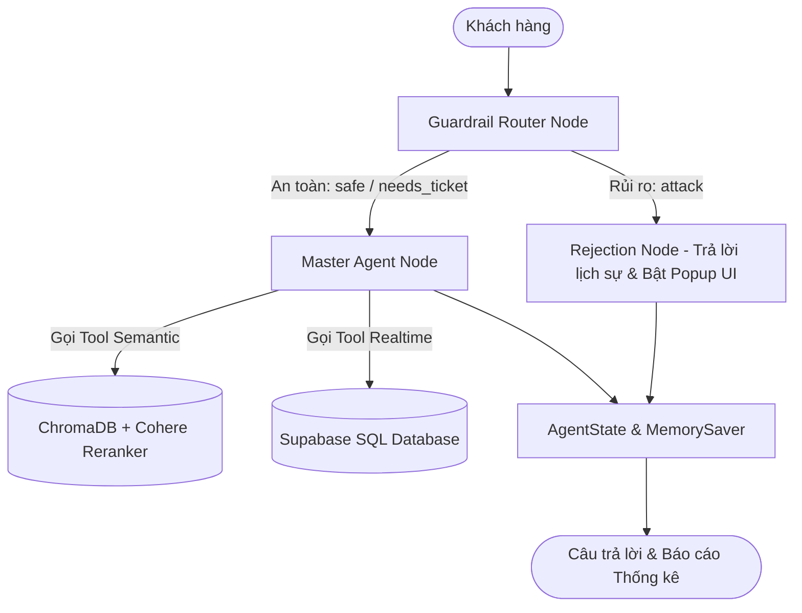

# Agentic RAG cho Thương Mại Điện Tử (E-commerce Agentic RAG)

Hệ thống RAG thông minh (Agentic RAG) hỗ trợ tư vấn bán hàng, tra cứu sản phẩm điện tử, kiểm tra tồn kho theo thời gian thực và quản lý hội thoại đa lượt sử dụng **LangGraph Orchestration** kết hợp với **Custom Pure Python ReAct Agent**.

---

## 🌟 Tính Năng Nổi Bật (Key Features)

- 🛡️ **Hệ Thống An Ninh & Guardrail Phân Loại 3 Cấp (Security Guardrail)**:
  - Phân loại câu hỏi thành `safe`, `needs_ticket`, hoặc `attack` (Prompt Injection / Roleplay Jailbreak).
  - Tự động chuyển hướng câu tấn công sang `rejection_node` để phát cảnh báo UI Popup và ngắt luồng xấu.
- 🤖 **Custom ReAct Master Agent (Viết Tay 100%)**:
  - Tự động suy luận nhiều lượt (Multi-turn ReAct Loop), gọi các Tools phù hợp (`product_search`, `check_stock`, `product_details`).
  - Hỗ trợ trích xuất thuộc tính suy luận mở rộng (như Gemini `thought_signature`).
- ⚡ **Kiến Trúc Hybrid RAG (Vector Search + SQL Real-time)**:
  - Vector DB (ChromaDB + Cohere Reranker) chuyên trách tra cứu dữ liệu thuộc tính tĩnh của sản phẩm.
  - Supabase SQL chuyên trách kiểm tra thông tin Giá & Tồn kho thực tế (Real-time Stock) tránh sai lệch tồn kho.
- 📜 **Lưu Trữ Lịch Sử Chat Đa Lượt (LangGraph Checkpointing)**:
  - Tận dụng `MemorySaver` quản lý State hội thoại theo `thread_id` (session_id).
  - Tương thích 100% cả Python Dict và LangChain Message Objects (`HumanMessage`, `AIMessage`).
- 📊 **Thống Kê Chỉ Số Hiệu Năng Chi Tiết (Detailed Metrics)**:
  - Theo dõi Thời gian phản hồi chữ đầu tiên (TTFT - Time To First Token).
  - Tổng số Token tiêu thụ (`input_tokens`, `output_tokens`, `total_tokens`) và Tổng độ trễ (`latency`) theo từng lượt và toàn phiên.

---

## 🏗️ Kiến Trúc Hệ Thống (Architecture Overview)



---

## 📁 Cấu Trúc Thư Mục (Project Structure)

```text
Agenttic-RAG-for-e-commerce/
├── database/                   # Lưu trữ SQLite & Vector DB cục bộ (ChromaDB)
├── ke-hoach-agentic-rag-tmdt.md # Kế hoạch tổng thể dự án
├── agent_graph_architecture.md # Tài liệu chi tiết thiết kế Agent & Graph
├── rag-service/
│   ├── configs/                # Quản lý cấu hình YAML & AppConfig
│   ├── notebooks/              # Chuỗi Notebook thử nghiệm & Benchmark
│   │   ├── 01_eda_data.ipynb
│   │   ├── 02_load_cleaner_chunker.ipynb  # Ingestion & Re-index Vector DB
│   │   ├── 03_test_retrieval.ipynb
│   │   ├── 04_test_LLMService.ipynb
│   │   ├── 05_test_tools_agent.ipynb       # Kiểm thử hệ thống Tools
│   │   ├── 06_test_agent.ipynb             # Benchmark Security Guardrails
│   │   ├── 07_01_workflow1.ipynb           # Test Workflow 1 & Stateful Chat
│   │   └── 08_benchmark.ipynb              # Đánh giá toàn diện
│   └── src/
│       ├── LLMService.py                   # Service kết nối Gemini / Groq (Chuẩn hóa Msg)
│       ├── a_ingestion/                    # Loader, Cleaner & Text Formatter
│       ├── b_indexing/                     # ChromaDB Vector DB, Embedding & Rerank
│       ├── c_retrieval/                    # ProductRetriever & PolicyRetriever
│       ├── d_tools/                        # ReAct Tools (product_search, check_stock, product_details)
│       ├── e_agents/                       # Custom Agents (GuardrailCall, MasterAgent, RejectionCall)
│       ├── f_prompts/                      # Module quản lý System & Few-shot Prompts
│       └── g_pipelines/                    # LangGraph Workflows (Workflow 1 & Workflow 2)
└── README.md
```

---

## 🚀 Hướng Dẫn Chạy Thử (Quick Start)

### 1. Cài đặt môi trường Conda

```bash
conda activate DL
```

### 2. Khởi tạo cấu hình `.env`

Tạo file `rag-service/.env` với các API keys:

```env
GEMINI_API_KEY=your_gemini_api_key
GROQ_API_KEY=your_groq_api_key
COHERE_API_KEY=your_cohere_api_key
SUPABASE_URL=your_supabase_url
SUPABASE_KEY=your_supabase_key
```

### 3. Chạy thử nghiệm Workflow trong Notebook

Mở notebook `rag-service/notebooks/07_01_workflow1.ipynb` và thực thi các Cell để khởi tạo LangGraph Workflow 1 và chat thử nghiệm đa lượt với Bot!

---

## 🛠️ Công Nghệ Sử Dụng (Tech Stack)

- **Language & Core**: Python 3.11+, LangGraph, LangChain Core (Message Types).
- **LLM Providers**: Google Gemini API (`google.genai`), Groq API (`openai/gpt-oss-120b`).
- **RAG & Vector Search**: ChromaDB, Cohere Rerank API.
- **Database**: Supabase (PostgreSQL).
